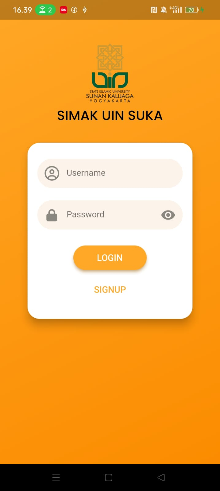
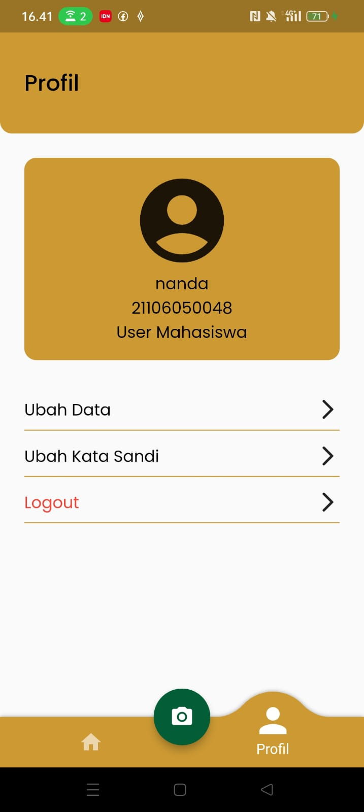

# simak_uin_suka

Application to assist the process of scheduling and attendance at the university

# Show Case
   

 

Attendance with QR Code Scanning (For Student user)  

Create schedule for class (For Lecturer user)  
 

# Features
1. view the schedule list
2. make attendance by scanning QR
3. Make a class schedule

# Features (Soon)
1. View course details
2. Attendance summary
3. Grades summary

# Tech Stack
Database: MongoDB  
Design Pattern: -  
State Management: -

